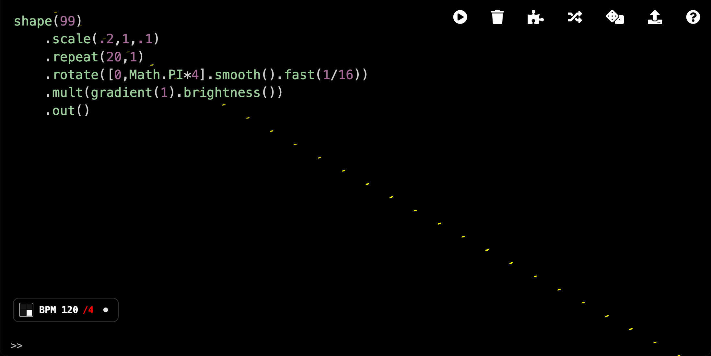

# Hydra BPM Tools

Minimal BPM HUD with tap/resync and beat-synced envelopes for [Hydra](https://hydra.ojack.xyz/).



## Quick Start

Just paste this code at the top of the Hydra editor:

```js
await loadScript("https://link.beatmelab.com/hydra-bpm-tools")
```

Done. You now have a draggable BPM HUD, BPM control via tap tempo and keyboard shortcuts, and helper functions such as `beats()` and `curve()`.

> **Direct jsDelivr URL**
>
> ```js
> await loadScript("https://cdn.jsdelivr.net/gh/beatmelab/hydra-bpm-tools@v2.0.0/hydra-bpm-tools.lib.js")
> ```

## Shortcuts

| Shortcut | Action |
|----------|--------|
| `Ctrl+Shift+T` | Tap tempo |
| `Ctrl+Shift+R` | Resync (reset time to 0) |
| `Ctrl+Shift+↑/↓` | Adjust BPM |
| `Ctrl+Shift+←/→` | Halve/double rate multiplier |
| `Ctrl+Shift+B` | Toggle hush (blank output) |

## Beat Envelopes

```js
beats(n)      // Ramp 1→0 over n beats
beats_(n)     // Ramp 0→1 over n beats
beatsTri(n)   // Triangle wave (1→0→1) over n beats
beatsTri_(n)  // Inverted triangle wave
```

Chain `.curve(q)` for easing and `.range(min, max)` to scale output:

```js
osc().scale(beatsTri(2).curve(2).range(1, 2))
```

## Programmatic API

```js
hydraBpmTools.setBpm(140)
hydraBpmTools.getBpm()
hydraBpmTools.setRate(2)        // x2 multiplier
hydraBpmTools.resync()
hydraBpmTools.toggleHush()
```

## Alternative for Auto-load (Userscript)

If you want Hydra BPM Tools to load automatically every time you open Hydra, you can install it as a browser userscript:

1. Install a userscript manager like [Tampermonkey](https://www.tampermonkey.net/) or [Violentmonkey](https://violentmonkey.github.io/).
2. Click the button below to install:

[](https://raw.githubusercontent.com/beatmelab/hydra-bpm-tools/main/hydra-bpm-tools.user.js)

## Author

[@alt234vj](https://www.instagram.com/alt234vj) · [@beatmelab](https://www.instagram.com/beatmelab) · [beatmelab.com](https://www.beatmelab.com)

## Attribution

Envelope API adapted from [`geikha/hyper-hydra`](https://github.com/geikha/hyper-hydra).

## License

GPL-3.0
